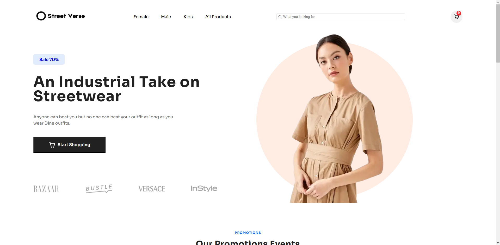

# Streetverse - E-Commerce Website

StreetVerse is a modern, sleek e-commerce platform built with the latest technologies to provide a seamless shopping experience. The website is designed to be fast, responsive, and user-friendly, ensuring an exceptional experience for both customers and administrators.

## Tech Stack

- **Next.js**: A React-based framework for server-side rendering and static site generation.
- **Sanity**: A flexible and scalable headless CMS for content management.
- **Stripe**: Secure payment processing for online transactions.
- **React Hot Toast**: A customizable notification system for displaying messages to users.
- **React Icons**: A library of icons to enhance UI/UX.
- **Swiper JS**: A modern mobile-friendly slider library for beautiful and responsive carousels.
- **Canvas Confetti**: A library for creating confetti effects for celebratory moments (like successful purchases).

## Features

- **Product Browsing**: Users can browse and filter products with ease.
- **Cart Functionality**: Add, remove, and edit items in the cart.
- **Secure Checkout**: Payment integration with Stripe for secure transactions.
- **Notifications**: Real-time notifications for successful purchases or updates using React Hot Toast.
- **Sliders**: Beautiful product carousels powered by Swiper JS.
- **Celebratory Confetti**: Enjoy a fun confetti animation when a purchase is completed successfully.

### Credit
[Figma Web Design & UI kit i used for this project is design by Weird Design Studio](https://ui8.net/ui-market/products/e-commerce-ui-website-design?status=7)

## Installation

1. Clone the repository:
   ```bash
   git clone https://github.com/Amandeep-Singh-Khalsa/Streetverse.git
   ```

2. Navigate to the project folder:
   ```bash
   cd Streetverse
   ```

3. Install dependencies:
   ```bash
   npm install
   ```

4. Set up environment variables:
   - Create a `.env.local` file in the root of the project.
   - Add the necessary variables such as Stripe API keys and Sanity project details.

5. Run the development server:
   ```bash
   npm run dev
   ```

6. Open your browser and go to `http://localhost:3000` to view the app.

## Screenshots




